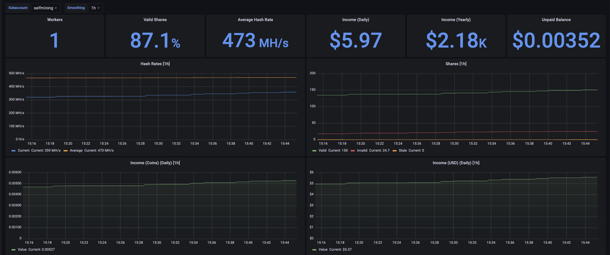
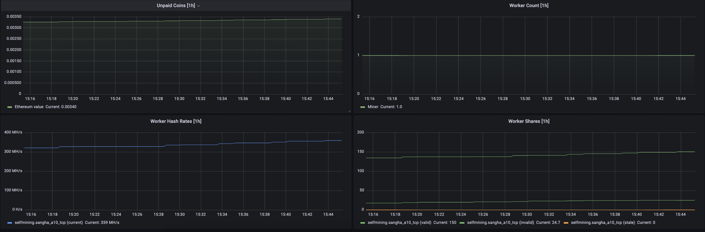

# Prometheus Luxor Exporter

Fork of this repo [prometheus-ethermine-exporter](https://github.com/HON95/prometheus-ethermine-exporter).

The original is an exporter for the following cryptocurrency mining pools: 
Ethermine, Ethermine ETC, Ethpool, Zcash Flypool, Ravencoin Flypool, BEAM Flypool. 
The exporter uses a unified API structure for all the listed pools, so we create a fork
to be used with our graphql api.

## Usage
Information on how to use it can be seen [here](dev/how-to.md).

## Grafana

Example dashboards:

[Miner dashboard](dashboard.json)

## Configuration
Docker Image can be found [here](https://hub.docker.com/repository/docker/luxorlabs/prometheus-luxor-exporter)

## Metrics
See the miner example output [here](examples/output-miner.txt)

## Development
Build: go build -o prometheus-luxor-exporter cmd/prometheus-luxor-exporter/*.go
Lint: golint ./...

# Changelog

## [1.0.0] - 2022-06-24

Initial release.